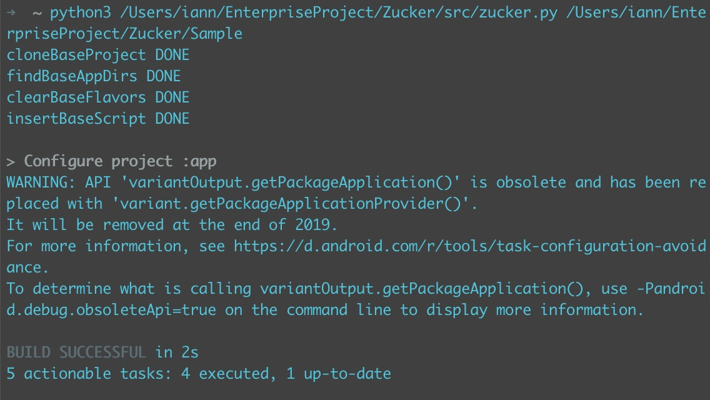
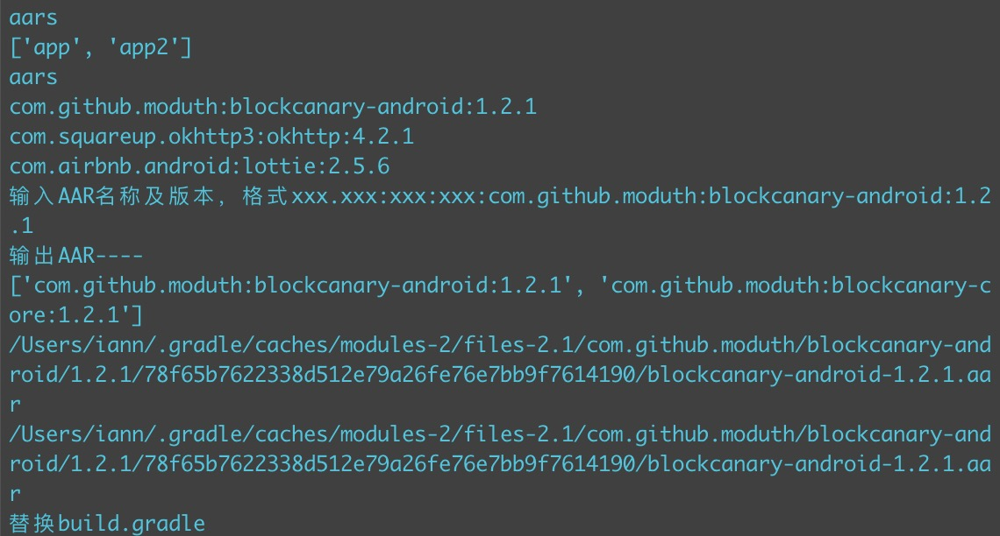
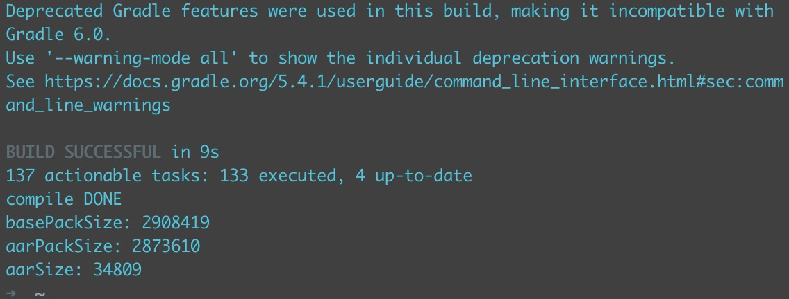

# Zucker: An easier way to automatically calculate the size of AAR in apk.


[中文文档](README_CN.md)
[Python使用规范](./docs/Python使用规范.md)

> As we all know,that when the project was introduced with AAR, it was not accurate to calculate only the aAR file size. Because aar is unzipped during packaging, the resource files are merged and then compressed, the actual apk footprint may be smaller than the current aar file size. Zucker was born to calculate the size of the target AAR at apk.


## Requirements

- Python 3.7+
- Android Dev
- Gradle 2.0+
- *unx/Windows

## Get Start

The first time you use Zucker for AAR size calculations, it is recommended to compile once on the command line.

Compile-time recommended `gradlew` command to ensure the use of the project's 'gradle' configuration
Perform the following command:
```
./gradlew build
```
Execute the following command in the terminal:
```
python3 xxx/zucker.py xxx/targetProjectName(Android project)
```


The script is executed automatically, obtaining the dependencies in the project and outputing a level-level node, which can select the target node for AAR size calculation.



Finally, after packaging, the AAR size is displayed on the terminal.



> It is recommended to test the project's 'sample project' first, as detailed in the project [README](Sample/README.md)

## Q&A
- a dependency on local library module (implementation project(':xxx'))  is not support.

## Contribute

See [CONTRIBUTING](CONTRIBUTING.rst)


## Licence


 Copyright (C) 2005-present, 58.com.  All rights reserved.

 Licensed under the Apache License, Version 2.0 (the "License"); you may
 not use this file except in compliance with the License. You may obtain
 a copy of the License at
     http://www.apache.org/licenses/LICENSE-2.0

 Unless required by applicable law or agreed to in writing, software
 distributed under the License is distributed on an "AS IS" BASIS, WITHOUT
 WARRANTIES OR CONDITIONS OF ANY KIND, either express or implied. See the
 License for the specific language governing permissions and limitations
 under the License.