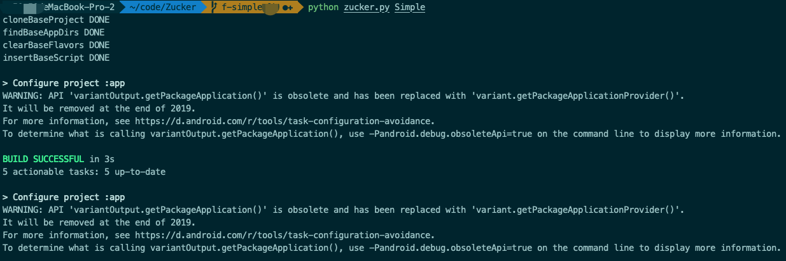
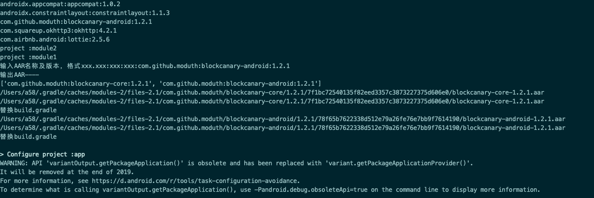

# sample

## 步骤
1. 将sample工程和`zucker.py`脚本放置到空文件夹中
2. 终端cd到该目录下执行`python zucker.py Sample`
3. 看到输出一级节点，选择一个非support包和jetbean相关的AAR名称。输入规则：`xxx.xxx:xxx:xxx`
4. 等待计算完成即可

### 执行脚本

### 选择要计算的AAR

### 计算结果
