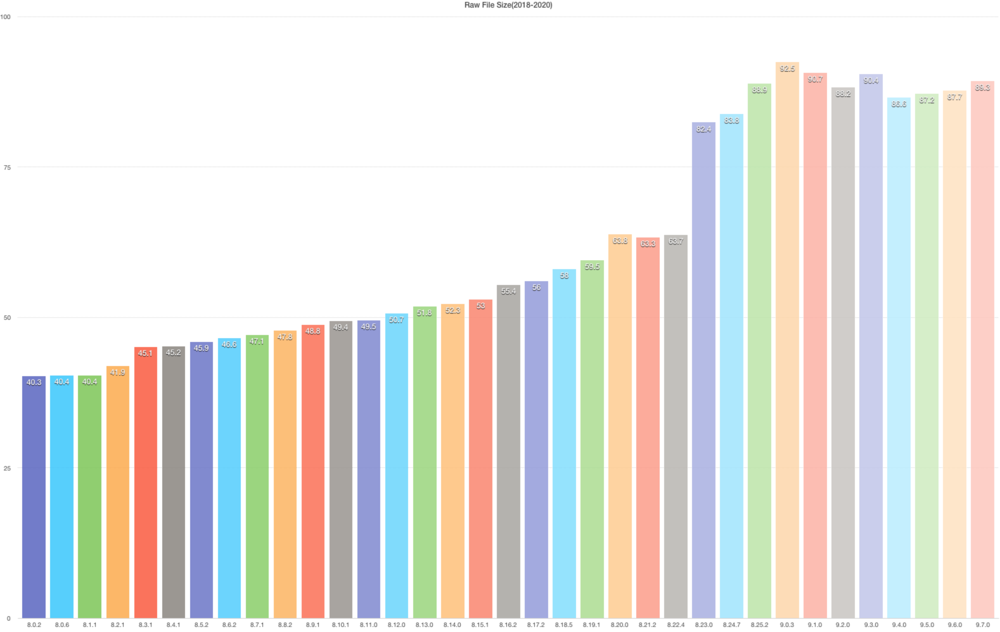
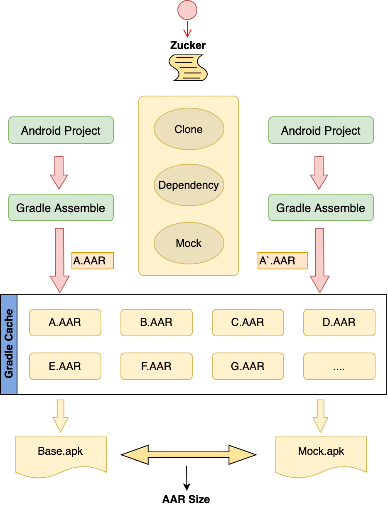
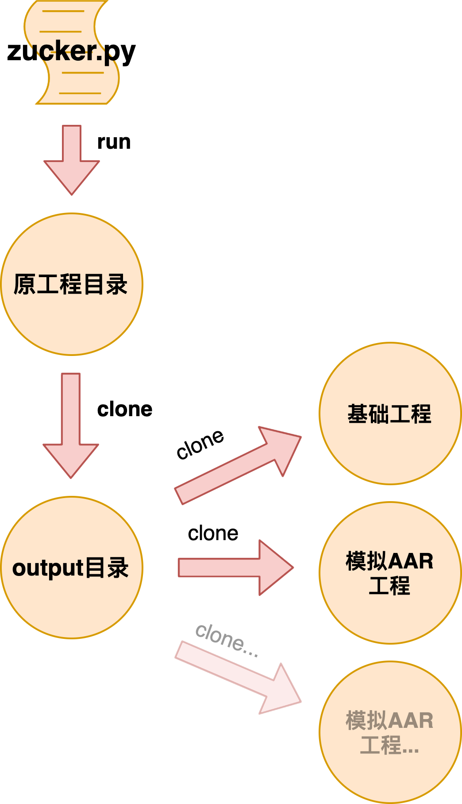
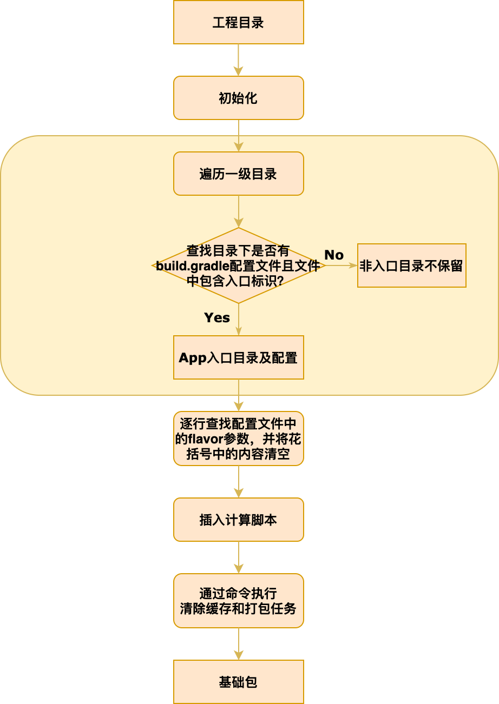
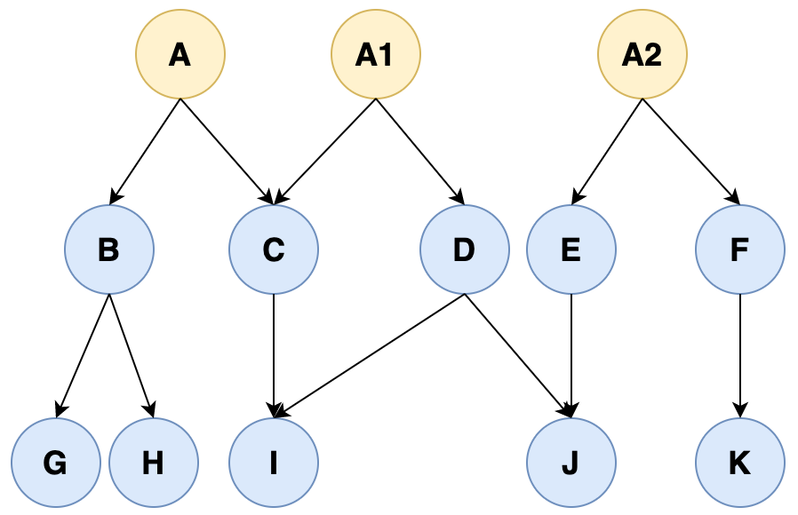
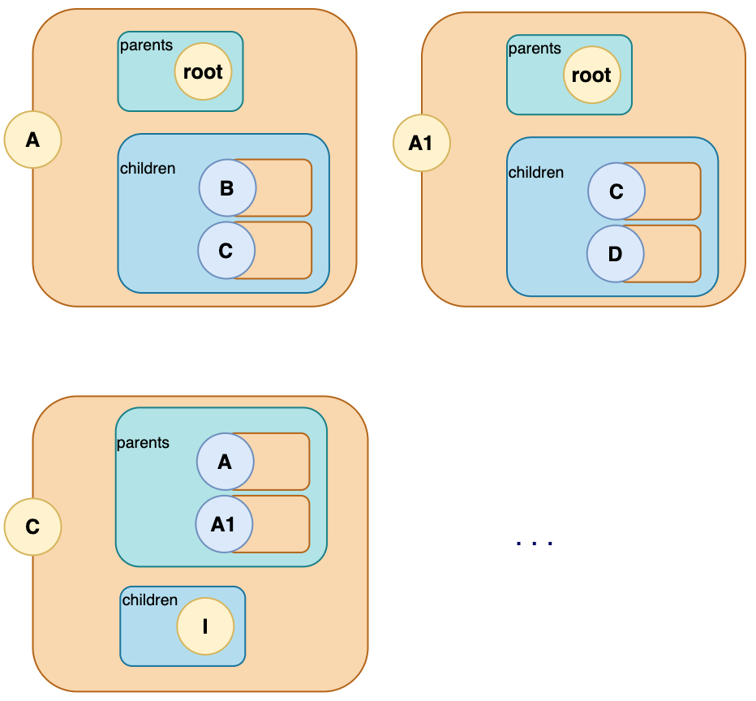
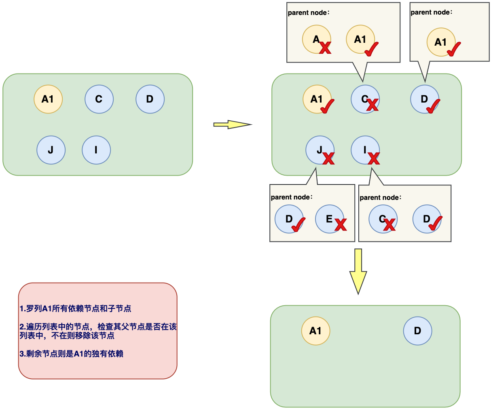
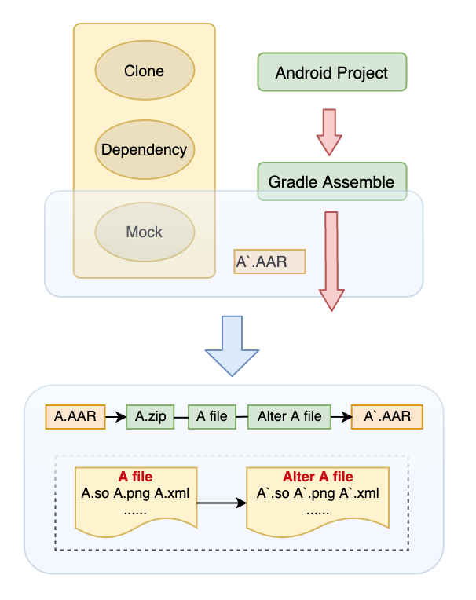

## Zucker介绍

### 导语
本文介绍了在实际场景中，随着App模块功能增多包体积不断增大，如何通过脚本自动化分析模块体积大小，无侵入且快速差值计算，具有一定实践意义，希望本文的介绍对大家有所启发。
 
### 背景
随着业务功能迭代、包体积大小呈曲线快速上升，如何做到业务功能增加映射为包体积大小增加。在手动统计将近20个版本（如下图一：各版本大小比对），从统计各版本APK包体积大小到统计当前版本APK中某需求增加多大体积，再到自动化统计APK中各模块所占大小，经历了从手动到自动化、脚本化的完整过程。


图一：各版本大小比对

### Zucker
正是基于这样的背景，我们隆重推出了开源工程Zucker，一个自动化无侵入计算模块化大小的工具，帮助我们深入了解每个模块在工程打包生成安装包APK中的体积大小占比，这样就可对其进行迭代监控及优化。例如，App包大小不可能是完全的增量，从功能层面监控其大小方便日后对其功能进行删减；此外，一个AAR被引入后导致APK体积增大多少，针对增大的数量级别我们可以选择是否接入或者考虑其他的实现方式。

#### 核心功能
Zucker模块化统计实现是通过Python脚本利用Gradle缓存将目标AAR替换为模拟AAR，结合Gradle打包命令，分别打出基础包和模拟AAR后的安装包，最后通过差值计算两个APK体积大小得出AAR大小。如下图二：Zucker统计流程：

 
 
图二 - Zucker统计流程

Zucker特点：
- 无侵入：无需添加或修改项目代码，只需将Zucker放置于待统计工程的目录下，运行Zucker脚本。
- 自动化：自动化寻路App入口、自动化分析依赖关系以及完成打包流程、自动化输出结果。
- 操作简单：脚本运行后输入统计列表中目标AAR名称，待打包完成即可得出结果。

### 具体实现
 #### 自动化打包统计

对于一个给定的目标工程首先避免产生侵害和改动，需要对源码工程做拷贝处理。则第一步把源码工程克隆到一个输出目录里。然后编译克隆后的工程，产出一个基础的APK并计算基础包大小。接着，脚本会根据用户指定要统计的AAR名称及版本信息，分析工程中AAR的依赖关系，自动产生一个空AAR来模拟目标AAR，并保持原工程中依赖关系。此时对模拟并替换了目标AAR后的克隆工程进行打包，计算出模拟AAR的APK大小。最后，通过打出的两个包的大小差值，可以得到目标AAR的大小。

#### 克隆工程

为了实现无侵害计算，需要修改工程的gradle脚本来实现自动模拟AAR以及计算包大小，将原有工程进行克隆再分析模拟AAR及打包统计。
Zucker的Python脚本文件需要放置目标工程的同级目录，运行脚本在同级目录产生一个output目录，统一存放拷贝的工程文件。

 
 
图三 - 工程及AAR克隆

#### 编译过程

整个编译过程包括以下步骤：初始化工程→自动寻路查找工程入口→清除flavors→插入计算脚本→执行打包命令。通过此流程，可完整实现自动化寻路APP入口并修改配置来实现基础包打包和计算包体积大小任务。

 
 
图四 - 编译打包流程

#### 依赖分析

在上文中提到获取用户输入的AAR，分析工程中各模块依赖关系。获取AAR的相互依赖关系，对于计算AAR大小起到关键作用。首先明确两个依赖关系概念。
•	独有依赖：对于某一AAR，内部引用库仅被当前AAR所依赖，再无其他依赖关系，则这个库被称为AAR的独有依赖。
•	公有依赖库：不同于独有依赖，一个库可能被多个AAR所引用，则这个库被称为公有依赖。
	回到上面说的，若要统计AAR在App包大小中的占比，除了它自己还不够，还要分析该AAR的独有依赖才能正确计算引入该AAR后的大小。

#### 依赖树转化

在项目的Gradle文件中可以找到该项目的依赖引用，项目执行`./gradlew dependencies`命令后会获取当前项目的依赖树结构，查看gradle命令输出的依赖树可知，依赖树有且比较严格的格式标准，特殊字符+，\，|表示依赖关系起始，空格缩进表示上下级引用关系。部分依赖关系如下：

``` xml
+--- com.android.support:design:28.0.0
| +--- com.android.support:support-annotations:28.0.0
| +--- com.android.support:support-compat:28.0.0 (*)
| +--- com.android.support:support-core-ui:28.0.0 (*)
| +--- com.android.support:support-core-utils:28.0.0 (*)
| +--- com.android.support:support-fragment:28.0.0 (*)
| +--- com.android.support:transition:28.0.0
| | +--- com.android.support:support-annotations:28.0.0
| | \--- com.android.support:support-compat:28.0.0 (*)
| +--- com.android.support:appcompat-v7:28.0.0 (*)
| +--- com.android.support:cardview-v7:28.0.0
| | \--- com.android.support:support-annotations:28.0.0
| \--- com.android.support:recyclerview-v7:28.0.0
| +--- com.android.support:support-annotations:28.0.0
| +--- com.android.support:support-compat:28.0.0 (*)
| \--- com.android.support:support-core-ui:28.0.0 (*)
```

我们可以将项目中的依赖库简化成A，B，C来表示，如图所示，A，A1，A2表示项目直接引用的AAR依赖。B，C是A的子依赖，同时C，D是A1的子依赖。根据上文所述，A的内部依赖B没有其他的被依赖关系，因此称B为A的独有依赖。另外的由于C同时被A和A1依赖，因此称C为公有依赖。



图五 - 节点依赖关系图

理解依赖树结构特点，可将依赖树形结构转化成列表来显示。由上述分析可知一个依赖库可能被多个库依赖，产生依赖关系。同时依赖关系是单向有序的，箭头指向表示A依赖B：A是B的父依赖，B是A的子依赖。现挑出A，A1，C作为例子分析，将A，A1作为一个父节点，节点内部同时维护两个列表，父节点列表（parents）和子节点列表（children）。依次就可以将依赖树中所有的依赖关系放置在节点类型的数据结构中。另外root节点是工程总节点，它是A，A1和A2的父节点。通过此步骤，得到依赖列表，记录工程中所有依赖节点：


 
图六 - 节点依赖列表

#### 独有依赖分析

统计目标AAR大小时，不仅要统计目标AAR还要包括它的独有依赖。通过上文步骤获取到了项目所有AAR列表，在输入目标依赖名称后，我们在列表中遍历找到该目标，检查其子依赖然后获取最后的独有依赖，检查流程如下：
1. 罗列目标依赖下的所有子依赖，并且遍历子依赖的子依赖，将它们记录到新列表中；
2. 采用深度便算法来逐一去判断新列表中的依赖，判断其父依赖是否仅在该列表中，如果父依赖全部都在该列表中则保留，否则从列表中可删除该依赖；
3. 经过步骤2后的筛选，剩下的节点则为目标依赖的独有依赖。

下面我们以上文图中的节点A1为例，将A1节点所有的子节点记录到列表。首先独有依赖包括它自身，故A1保留。C节点的父父节点有A和A1，A不在当前列表中，因此C不是独有依赖，将C移除。D的父节点仅有A1且在列表中，因此D是独有依赖。以此类推，在判断I节点时，由于C节点已被移除不在列表中，因此I也不是A1的独有依赖。如下图九：节点独有依赖寻找流程： 


 
图七 - 节点独有依赖寻找流程

#### 模拟目标AAR

在项目打包生成Apk过程中，会利用Gradle缓存特性，工程编译前，获取用户输入的目标AAR，脚本通过目标AAR名称在缓存目录下自动寻找。然后将本地的目标AAR文件进行模拟处理，打包时将该模拟后的AAR打入APK中。如下图八 ：模拟替换目标AAR流程：

 
 
图八 - 模拟替换目标AAR

我们知道AAR是二进制归档文件，也是压缩文件，只不过它是AAPT打包命令中的一个结果，通常会压缩：资源文件、类文件、系统文件等。所以找到该AAR后，我们进行“解剖”，步骤如下：
1. 将目标AAR在当前目录下备份一份；
2. 将AAR文件重命名变成.zip文件并进行解压缩；
3. 遍历解压缩文件目录，当目标是文件时，判断其文件类型是否为.xml或.9.png，是则跳过；否则，将其文件大小置为0KB；
4. 解压缩文件完全按照3步骤处理完成后，将其重新压缩为一个模拟的AAR文件，参与打包计算；
5. 打包完成后，为了不影响后续打包任务，删除模拟的AAR将备份的AAR文件恢复；
6. 修改build.gradle文件，使用Gradle的打包特性配置所有all*.exclude移除对应的group和module；
