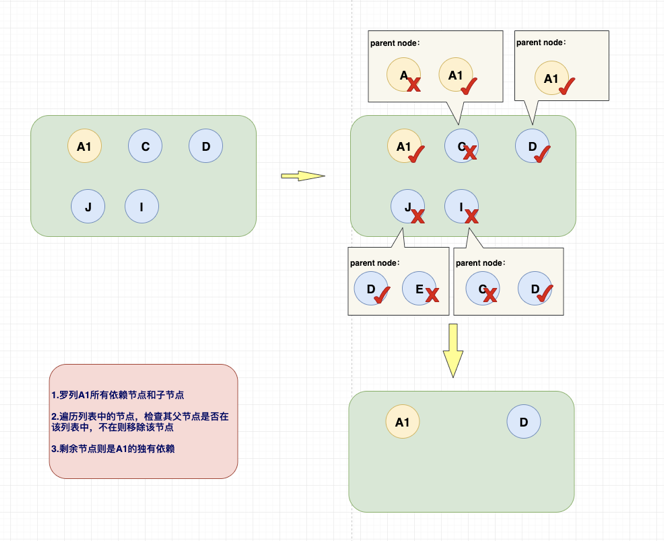

#### 扎克项目

>利用dependency依赖树，采用Mock Module，组装原aar目录结构的mock

##### Dependency依赖

###### 统计目标AAR的独有依赖库&公有依赖库
独有依赖库：是目标AAR的单独依赖，比如D

公有依赖库：是该AAR包含多个公共依赖，比如E




###### dependency依赖节点Demo

```
   +--- com.wuba.wuxian.lib:58HouseAJKLib:920-0.1.97
|    +--- org.jetbrains.kotlin:kotlin-android-extensions-runtime:1.3.31 -> 1.3.41 (*)
|    +--- javax.inject:javax.inject:1
|    +--- me.relex:photodraweeview:1.1.3
|    +--- com.alibaba.android:tangram:2.2.3
|    |    +--- com.alibaba.android:vlayout:1.2.12
|    |    |    +--- com.android.support:support-v4:25.2.0 -> 28.0.0 (*)
|    |    |    +--- com.android.support:support-annotations:25.2.0 -> 28.0.0
|    |    |    +--- com.android.support:support-compat:25.2.0 -> 28.0.0 (*)
|    |    |    \--- com.android.support:support-core-ui:25.2.0 -> 28.0.0 (*)
|    |    +--- com.android.support:support-v4:23.1.1 -> 28.0.0 (*)
|    |    +--- com.android.support:support-annotations:23.1.1 -> 28.0.0
|    |    +--- com.alibaba.android:ultraviewpager:1.0.6.9
|    |    |    \--- com.android.support:support-v4:23.1.1 -> 28.0.0 (*)
|    |    +--- me.everything:overscroll-decor-android:1.0.1
|    |    \--- com.alibaba.android:virtualview:1.0.6 -> 1.1.1
|    |         \--- com.alibaba.android:virtual-common:1.0.6
|    +--- com.alibaba.android:vlayout:1.2.12 (*)
|    +--- com.alibaba.android:ultraviewpager:1.0.6.9 (*)
|    +--- me.everything:overscroll-decor-android:1.0.1
|    +--- com.alibaba.android:virtualview:1.1.1 (*)
|    +--- com.andkulikov:transitionseverywhere:1.7.0
|    |    \--- com.android.support:support-v4:22.2.1 -> 28.0.0 (*)
|    +--- com.wbvideo:pushrequest:2.4.6.10 (*)
|    +--- com.google.android:flexbox:0.3.0
|    |    \--- com.android.support:support-compat:25.3.1 -> 28.0.0 (*)
|    +--- com.android.support:cardview-v7:27.0.2 -> 28.0.0 (*)
|    +--- com.anjuke.mobile:sign:1.1.2-SNAPSHOT -> 1.2.0
|    +--- org.jetbrains.kotlin:kotlin-stdlib:1.3.31 -> 1.3.41 (*)
|    +--- com.j256.ormlite:ormlite-android:5.0
|    |    \--- com.j256.ormlite:ormlite-core:5.0
|    +--- com.jakewharton:butterknife:9.0.0
|    |    \--- com.jakewharton:butterknife-runtime:9.0.0
|    |         \--- com.jakewharton:butterknife-annotations:9.0.0
|    \--- com.alibaba:arouter-api:1.4.0 (*)


+--- com.wuba.wuxian.lib:58HouseBaseLib:8250-0.1.19
+--- com.wuba.wuxian.lib:58AnjukeLib:920-0.1.91
|    +--- or
g.jetbrains.kotlin:kotlin-android-extensions-runtime:1.3.31 -> 1.3.41 (*)
|    +--- com.alibaba:arouter-api:1.4.0 (*)
|    +--- com.anjuke.android.newhouse:newhousemodule:0902-1.0.0
|    |    +--- org.jetbrains.kotlin:kotlin-android-extensions-runtime:1.3.41 (*)
|    |    +--- org.jetbrains.kotlin:kotlin-stdlib-jdk7:1.3.21 -> 1.3.41
|    |    |    \--- org.jetbrains.kotlin:kotlin-stdlib:1.3.41 (*)
|    |    +--- com.jakewharton:butterknife:9.0.0 (*)
|    |    +--- com.alibaba:arouter-api:1.4.0 (*)
|    |    +--- com.anjuke.android.datasourceloader:datasourceloader:0902-1.0.0
|    |    |    +--- com.squareup.retrofit2:retrofit:2.5.0
|    |    |    +--- com.squareup.retrofit2:adapter-rxjava:2.5.0
|    |    |    |    \--- com.squareup.retrofit2:retrofit:2.5.0
|    |    |    +--- com.squareup.okhttp3:logging-interceptor:3.12.0
|    |    |    +--- com.j256.ormlite:ormlite-android:5.0 (*)
|    |    |    +--- org.jetbrains.kotlin:kotlin-android-extensions-runtime:1.3.41 (*)
|    |    |    +--- com.anjuke.mobile:sign:1.2.0
|    |    |    +--- com.anjuke.android.commonutils:commonutils:1.0.4-SNAPSHOT
|    |    |    |    +--- com.android.support:support-v4:27.0.2 -> 28.0.0 (*)
|    |    |    |    +--- me.relex:photodraweeview:1.1.3
|    |    |    |    \--- com.meituan.android.walle:payload_reader:1.0.5
|    |    |    +--- org.jetbrains.kotlin:kotlin-stdlib-jdk7:1.3.21 -> 1.3.41 (*)
|    |    |    +--- org.jetbrains.kotlin:kotlin-reflect:1.3.21
|    |    |    |    \--- org.jetbrains.kotlin:kotlin-stdlib:1.3.21 -> 1.3.41 (*)
|    |    |    +--- com.anjuke.android.filterbar:filter_entity:1.0.1
|    |    |    \--- com.alibaba:arouter-api:1.4.0 (*)
|    |    +--- com.anjuke.android.commonbusiness:commonbusiness:0902-1.0.0
|    |    |    +--- com.anjuke.mobile:sign:1.2.0
|    |    |    +--- org.greenrobot:eventbus:3.0.0
|    |    |    +--- com.wuba.certify:deviceid:2.2.11 -> 2.2.17
|    |    |    +--- com.wuba.wmda:wmda:1.2.0
|    |    |    +--- com.wbvideo:codec:2.4.6.8 (*)
|    |    |    +--- com.wuba.wos:wupload:1.2.1
|    |    |    +--- com.wbvideo:player:2.4.7.10 (*)
|    |    |    +--- com.wbvideo:pushrequest:2.4.6.10 (*)
|    |    |    +--- com.wbvideo:pusher:2.4.6.10 (*)
|    |    |    +--- org.jetbrains.kotlin:kotlin-stdlib-jdk7:1.3.21 -> 1.3.41 (*)
|    |    |    +--- com.anjuke.android.commonutils:commonutils:1.0.4-SNAPSHOT (*)
|    |    |    +--- com.anjuke.android.uicomponent:uicomponent:0902-1.0.0
|    |    |    |    +--- com.android.support:cardview-v7:28.0.0 (*)
|    |    |    |    +--- com.google.android:flexbox:0.3.0 (*)
|    |    |    |    +--- net.cachapa.expandablelayout:expandablelayout:2.9.1
|    |    |    |    +--- com.anjuke.android.filterbar:filter_bar:1.0.6
|    |    |    |    |    \--- com.anjuke.android.filterbar:filter_entity:1.0.1
|    |    |    |    +--- com.anjuke.android.commonutils:commonutils:1.0.4-SNAPSHOT (*)
|    |    |    |    +--- com.android.support:animated-vector-drawable:28.0.0 (*)
|    |    |    |    +--- org.jetbrains.kotlin:kotlin-android-extensions-runtime:1.3.41 (*)
|    |    |    |    +--- com.android.support:support-annotations:28.0.0
|    |    |    |    \--- org.jetbrains.kotlin:kotlin-stdlib-jdk7:1.3.41 (*)
|    |    |    +--- org.jetbrains.kotlin:kotlin-android-extensions-runtime:1.3.41 (*)
|    |    |    +--- com.jakewharton:butterknife:9.0.0 (*)
|    |    |    +--- com.alibaba:arouter-api:1.4.0 (*)
|    |    |    +--- com.anjuke.android.datasourceloader:datasourceloader:0902-1.0.0 (*)
|    |    |    \--- com.anjuke.android.apt:module-application:1.0.1
|    |    \--- com.anjuke.android.apt:module-application:1.0.1
|    +--- com.anjuke.android.secondhouse:secondhousemodule:0902-1.0.0
|    |    +--- com.anjuke.android.app.share:share_component:1.0.10
|    |    |    \--- com.google.android:flexbox:0.3.0 (*)
|    |    +--- org.jetbrains.kotlin:kotlin-android-extensions-runtime:1.3.41 (*)
|    |    +--- com.jakewharton:butterknife:9.0.0 (*)
|    |    +--- com.alibaba:arouter-api:1.4.0 (*)
|    |    +--- com.anjuke.android.datasourceloader:datasourceloader:0902-1.0.0 (*)
|    |    +--- com.anjuke.android.commonbusiness:commonbusiness:0902-1.0.0 (*)
|    |    \--- com.anjuke.android.apt:module-application:1.0.1
|    +--- com.anjuke.android.community:communitymodule:0902-1.0.0
|    |    +--- org.jetbrains.kotlin:kotlin-android-extensions-runtime:1.3.41 (*)
|    |    +--- com.jakewharton:butterknife:9.0.0 (*)
|    |    +--- com.alibaba:arouter-api:1.4.0 (*)
|    |    +--- com.anjuke.android.commonbusiness:commonbusiness:0902-1.0.0 (*)
|    |    \--- com.anjuke.android.datasourceloader:datasourceloader:0902-1.0.0 (*)
|    \--- com.anjuke.android.user:usermodule:0902-1.0.0
|         +--- org.jetbrains.kotlin:kotlin-android-extensions-runtime:1.3.41 (*)
|         +--- com.anjuke.android.commonbusiness:commonbusiness:0902-1.0.0 (*)
|         +--- com.anjuke.android.datasourceloader:datasourceloader:0902-1.0.0 (*)
|         +--- com.anjuke.android.content:contentmodule:0902-1.0.0
|         |    +--- com.wbvideo:codec:2.4.6.8 (*)
|         |    +--- com.wuba.wos:wupload:1.2.1
|         |    +--- com.wbvideo:player:2.4.7.10 (*)
|         |    +--- com.wbvideo:pushrequest:2.4.6.10 (*)
|         |    +--- com.wbvideo:pusher:2.4.6.10 (*)
|         |    +--- org.jetbrains.kotlin:kotlin-android-extensions-runtime:1.3.41 (*)
|         |    +--- org.jetbrains.kotlin:kotlin-reflect:1.3.21 (*)
|         |    +--- org.jetbrains.kotlin:kotlin-stdlib-jdk7:1.3.21 -> 1.3.41 (*)
|         |    +--- com.anjuke.android.commonbusiness:commonbusiness:0902-1.0.0 (*)
|         |    +--- com.anjuke.android.datasourceloader:datasourceloader:0902-1.0.0 (*)
|         |    +--- com.alibaba:arouter-api:1.4.0 (*)
|         |    +--- com.jakewharton:butterknife:9.0.0 (*)
|         |    \--- com.anjuke.android.apt:module-application:1.0.1
|         +--- org.jetbrains.kotlin:kotlin-reflect:1.3.21 (*)
|         +--- org.jetbrains.kotlin:kotlin-stdlib-jdk7:1.3.21 -> 1.3.41 (*)
|         +--- com.alibaba:arouter-api:1.4.0 (*)
|         +--- com.jakewharton:butterknife:9.0.0 (*)
|         \--- com.anjuke.android.apt:module-application:1.0.1
+--- com.wuba.wuxian.lib:58HouseLib:920-0.3.78
+--- com.wuba.wuxian.lib:58HouseAJKMixLib:920-0.1.83
+--- com.wuba.wuxian.lib:58CarLib:920-0.2.17
+--- com.android.support:gridlayout-v7:28.0.0
|    +--- com.android.support:support-compat:28.0.0 (*)
|    \--- com.android.support:support-core-ui:28.0.0 (*)
+--- org.aspectj:aspectjrt:1.8.13
+--- com.wuba.wuxian.lib:58HuangyeLib:920-0.2.8
+--- com.wuba.wuxian.lib:58SaleLib:8250-0.1.41
+--- com.wuba.wuxian.lib:58PincheLib:8250-0.1.47
\--- com.wuba.wuxian.lib:WubaLoginLib:8250-2.6.37

```

##### 统计AAR大小

打包过程：

Android使用Gradle的构建工程，打包APK，Android的打包过程大概如下：

1.	打包资源文件，生成R.java文件和resources.arsc文件；
2.	处理aidl文件，生成相应的.java文件；
3.	编译工程中src、R.java、AIDL生成的 java 源码，生成.class文件；
4.	利用Dex将上一步生成的.class文件，生成classes.dex文件；
5.	打包生成apk；
6.  对apk文件进行签名以及签名的对齐处理。


利用打包特性：

1.	找到.gradle文件的缓存路径，并且根据目标AAR名称，寻找对应的AAR缓存目录；
2.	将该AAR进行解压，得到目标需要修改的资源文件；
3.	将修改后的文件进行重新压缩，再次生成AAR，执行打包；
4.	打包成功后，将修改过的AAR删除，防止再次打包时错误引用；


##### Statistics Module Size
执行脚本前，优先build构建一次原工程，以使工程构建成功。