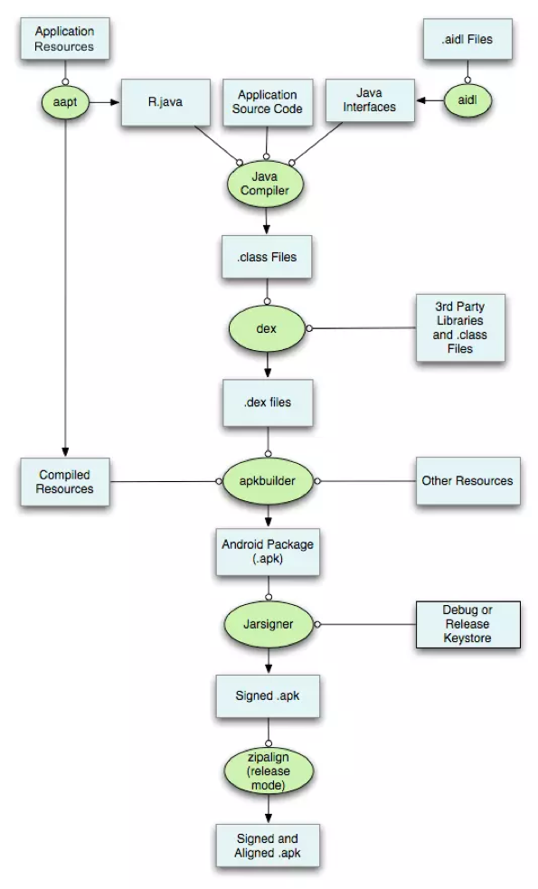

#### 扎克项目

>利用dependency依赖树，采用Mock Module，组装原aar目录结构的mock

##### Dependency依赖

###### 独有依赖库&公有依赖库
- **独有依赖库**：对于一个AAR来说，它内部引用的库仅被当前这个AAR依赖，没有其他的依赖关系，那么这个库被称为AAR的独有依赖。

- **公有依赖库**：不同于独有依赖，一个库可能被多个AAR所引用，那么这个库被称为公有依赖。

###### 依赖节点转化
执行`gradle dependencies`命令后会获取如下依赖树

我们可以将依赖树简化成一个树形结构,我们可以将项目中的依赖库简化成A、B、C来表示，
如下图所示，A、A1、A2表示项目直接引用的AAR依赖。B、C是A的子依赖，同时C、D是A1的子依赖。
根据上文解释A的内部依赖B没有其他的被依赖关系，因此称B为A的独有依赖。另外的由于C同时被A和A1依赖，因此称C为公有依赖。

###### 获取独有依赖
核心思想：
1)	罗列目标依赖下的所有子依赖，并且遍历子依赖的子依赖，将他们记录到新列表中
2)	逐一去判断新列表中的依赖，判断其父依赖是否仅在该列表中：如果父依赖全部都在则保留，否则从列表中移除该依赖
3)	经过步骤2)后的筛选，剩下的节点就为目标依赖的独有依赖

下面以上图中A1节点为例，获取独有依赖步骤如下

##### 统计AAR大小

打包过程：

Android使用Gradle的构建工程，打包APK，Android的打包过程大概如下：

1.	打包资源文件，生成R.java文件和resources.arsc文件；
2.	处理aidl文件，生成相应的.java文件；
3.	编译工程中src、R.java、AIDL生成的 java 源码，生成.class文件；
4.	利用Dex将上一步生成的.class文件，生成classes.dex文件；
5.	打包生成apk；
6.  对apk文件进行签名以及签名的对齐处理。

利用打包特性：

1.	找到.gradle文件的缓存路径，并且根据目标AAR名称，寻找对应的AAR缓存目录；
2.	将该AAR进行解压，得到目标需要修改的资源文件；
3.	将修改后的文件进行重新压缩，再次生成AAR，执行打包；
4.	打包成功后，将修改过的AAR删除，防止再次打包时错误引用；

##### Statistics Module Size
执行脚本前，优先build构建一次原工程，以使工程构建成功。